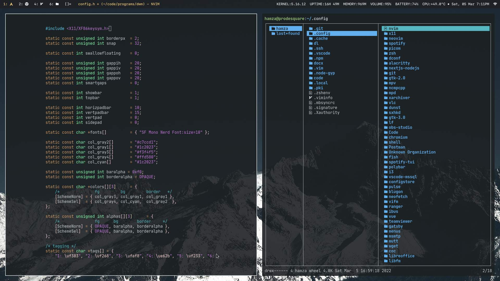

# [ProDeSquare](https://prodesquare.com)'s Dotfiles

## Usage
Clone the repo directly to your home directory and install dependencies. Mainly I use following programs in my workflow:
* [DWM](https://surl.prodesquare.com/l/dwm) (Window Manager)
* [DWM Blocks](https://surl.prodesquare.com/l/dwmblocks) (Statusbar)
* [Dmenu](https://surl.prodesquare.com/l/dmenu) (Application Launcher)
* Alacritty (Terminal Emulator)
